# DATA STRUCTURE
- A way to organize data so that it could be efficiently processed.

## ABSTRACT DATA TYPES
- It an abstraction that just defines interface to which a data stucture should adhere to.
- ADT just defines how a data structure should behave without any implementation detals.

|Abstract Data type   | DS implementation  |
|---------------------|--------------------|
| List                |Dynamic Array/Linked List |
| Queue               |Linked based queue/Array based/stack based |
| Map                 | Tree map/Hash map   |

# Complexity Analysis
### `Big-O` notation
- `Big-O` notation gives performace of our program in worst case scenario.
- notation from best to worst performance.

> *n -> size of input*

|||
|-|-|
| Constant time      | `O(1)`|
| Logarithmic time   |`O(log(n))` |
| Linear time        | `O(n)`   |
| Lineararithmic time| `O(nlog(n))`   |
| Quadratic time     | `O(n^2)`   |
| Cubic time         | `O(n^3)`   |
| Exponential time   | `O(b^n)` where `b > 1`  |
| Factorial time     | `O(n!)`  |

# Linked List
- sequential list of node which holds data.
- Every node points to (store reference to) to next element
- last node points to `null` reference denoting end of linked list

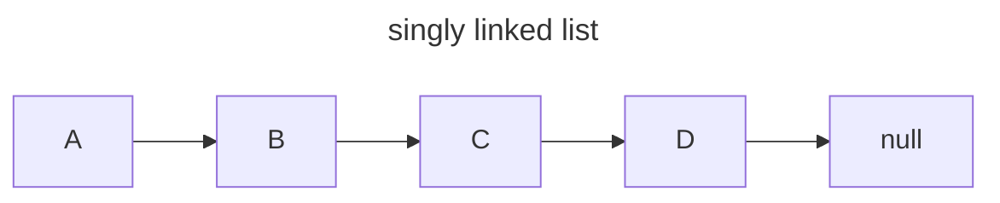

- `Doubly linked list` holds pointer to both previous and next node.
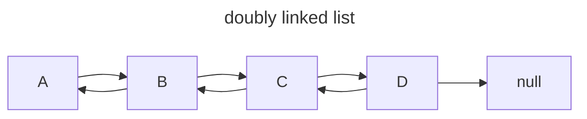
- We have `tail` pointer in addition to `head` pointer to quickly perform addition/removal of nodes from end.

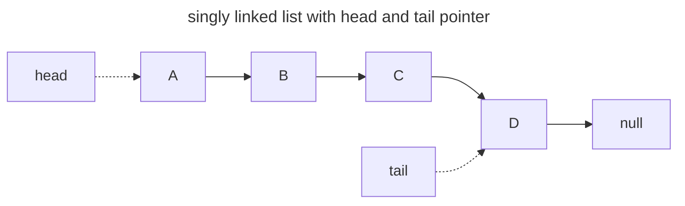

**Uses of Linked List**
- ADT for stack and queue implementation
- creating circular list
- implementing adjacency list in graph

**Complexity analysis of linked list operations**
|Operation|singly linked list|Doubly linked list|
|-|-|-|
| Search     | `O(n)`| `O(n)`|
| Insert head| `O(1)`| `O(1)`|
| Insert tail| `O(1)`| `O(1)`|
| Remove head| `O(1)`| `O(1)`|
| Remove Tail| `O(n)` | `O(1)`|
| Remove in middle| `O(n)`  | `O(n)` |

**Linked list practice problems**
- [remove-duplicates-from-sorted-list](https://leetcode.com/problems/remove-duplicates-from-sorted-list/description/)
- [remove-duplicates-from-sorted-list-ii](https://leetcode.com/problems/remove-duplicates-from-sorted-list-ii/)
- [merge-two-sorted-lists](https://leetcode.com/problems/merge-two-sorted-lists/description/)
- [remove-nth-node-from-end-of-list](https://leetcode.com/problems/remove-nth-node-from-end-of-list/description/)
- [design-linked-list](https://leetcode.com/problems/design-linked-list/)

# Stack
- A linear data structure where data can be inserted(push) and removed(pop) from one end
- Data in stack follows **`LIFO`** order i.e. Last In First Out.

### Uses of stack
- Used in editor to undo changes
- Used in browser to maintain history which helps navigate backward/forward
- Used in function calls to maintain call stack
- Used in compiler to ensure brackets are matched
- Used in DFS of trees

### Operations on stack
we can perform follwing operation on stack:
- Push : place a data at top of stack
- Pop  : remove a data from top of stack
- Peek : check the data at top of stack (without removing)

### Complexity analysis of stack operations
- Assuming we implement stack by linked list so we don't have consider complexity involved with shifting data or resizing with array implementation.

|Operation|complexity|
|-|-|
| Push   | `O(1)` |
| Pop    | `O(1)` |
| Peek   | `O(1)` |
| Search | `O(n)` |

### Stack practice problems
- [maximum-nesting-depth-of-the-parentheses](https://leetcode.com/problems/maximum-nesting-depth-of-the-parentheses/)
- [valid-parentheses](https://leetcode.com/problems/valid-parentheses/)

# Queue
- A linear data structure where data can be inserted(`enqueue`) from one end and removed from other end (`dequeue`)
- `Queue` is also call **`FIFO`** data structures i.e. First In First Out

### Uses of Queue
- model a real world queue
- keep track of sequence of recent n elements
- CPU management FIFO order
- request management by servers (first request is served first)
- BFS(Breadth First Search) graph traversal

### Complexity analysis of Queue operations
- Assuming we implement Queue by linked list so we don't have consider complexity involved with shifting data or resizing with array implementation.

|Operation|complexity|
|-|-|
| Enqueue| `O(1)` |
| Dequeue| `O(1)` |
| Peek   | `O(1)` |
| Search | `O(n)` |
| Removal| `O(n)` |
| isEmpty| `O(1)` |

### Queue practice problems
- [number-of-students-unable-to-eat-lunch](https://leetcode.com/problems/number-of-students-unable-to-eat-lunch/)
- [implement-stack-using-queues](https://leetcode.com/problems/implement-stack-using-queues/)
- [design-circular-queue](https://leetcode.com/problems/design-circular-queue/)

# Heap
- Its a `tree` data structure that satisfies the `heap invariant`🤓.
- heap invariant means for a node A in heap it should be greater or equal to all its children (for `max heap`) or it should be smaller or equal to all its children (in `min heap`)

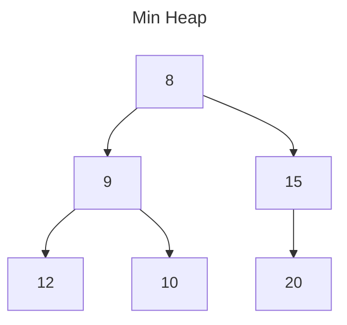
---
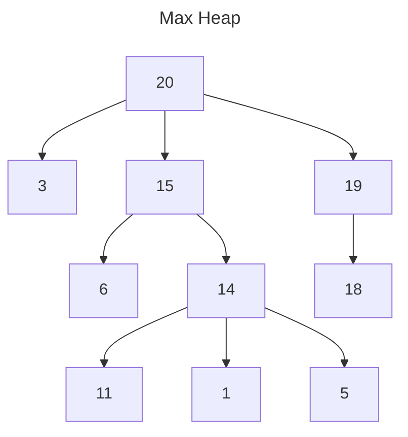

## Uses
- implementing priority queues

## Representing binary heap as array
- we can represent binary tree with an array 🤯. This is done by mapping each node of tree to an index in array.
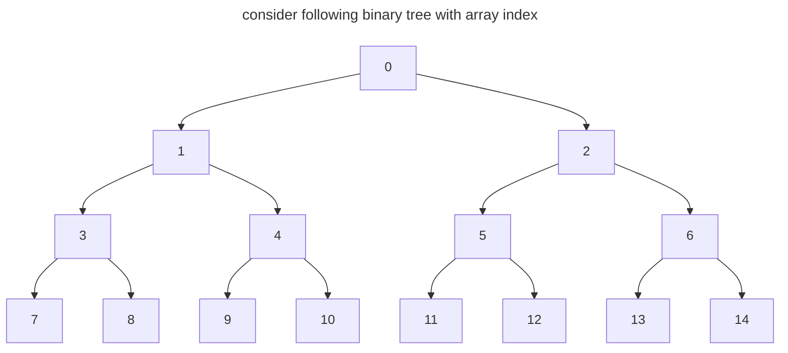

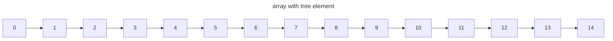

> We can notice that `ith` element on array has `2i+1` and `2i+2` as children in the corresponding binary tree


# Priority Queue
- It is similar to queue but items are removed based on some priority or ranking
- It can only hold element which are comparable since we need elements to be comparable to determine priority
- Priority queue uses heap.

## Uses of Priority Queue
- certain implementation Dijkstra's shortes algorithm
- to fetch next best/worst element
- used in huffman's encoding(used in lossless compression)
- used in minimum spanning tree algorithm

## Complexity analysis of priority queue implemented as heap
|Operation|complexity|
|-|-|
| Binary Heap consturction| `O(n)` |
| Polling/removing root | `O(log(n))` |
| Peeking   | `O(1)` |
| naive removing(non root removal) | `O(n)` |
| naive containse(check if element is present) | `O(n)` |

## Implementation
- Priority queue is generally implemetated using `complete binary tree` heap.
- `complete binary tree` is binary tree where all nodes have exactly 2 children except possibly the last ones and all nodes are to as far left as possible.

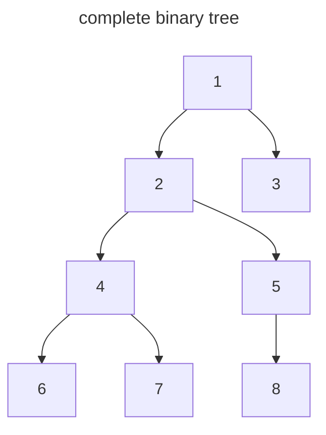

### Insertion technique for Priority queue using heap
- insert in last available position
- bubble up this value by swapping with parent node until it satisfies the heap invariant

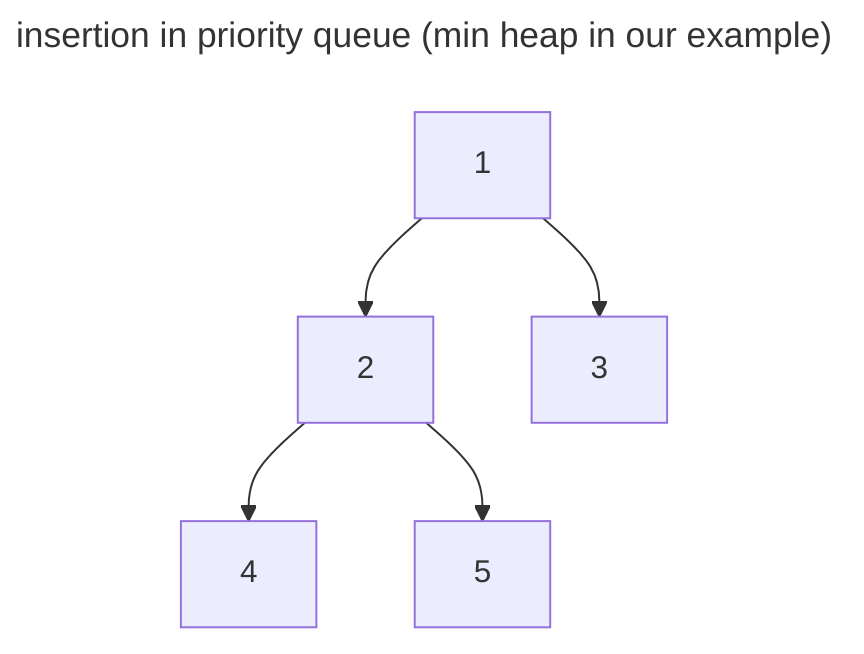

now if we want to insert `0`:
- we would add it as left child of 3.
- since 0 < 3, we swap it.
- 0 < 1, we again swap it get correct order for our priority queue.

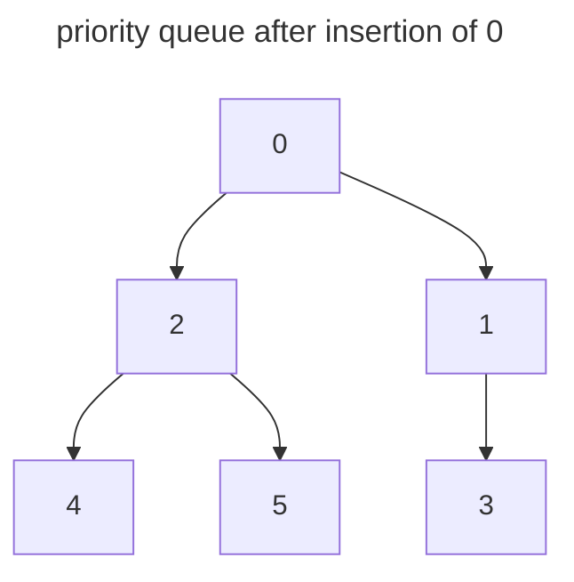

### Root element removal for priority queue using heap (polling)
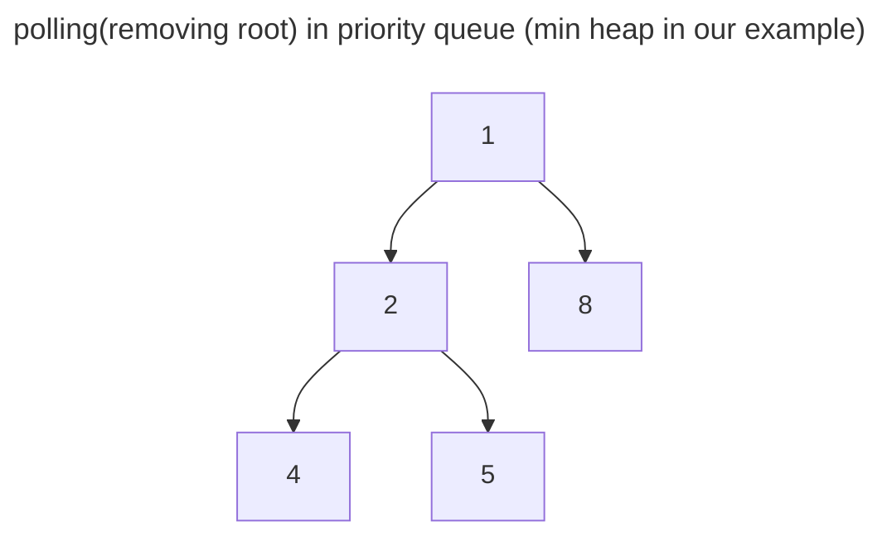

- replace root with last element here in this case make 5 root element
- bubble down 5 until we get a valid priority queue
- compare 5 with its chidren and swap with smallest one so, we swap 2 and 5
- compare 5 with its chidren and swap with smallest one so, we swap 4 and 5
- now we have valid priority queue

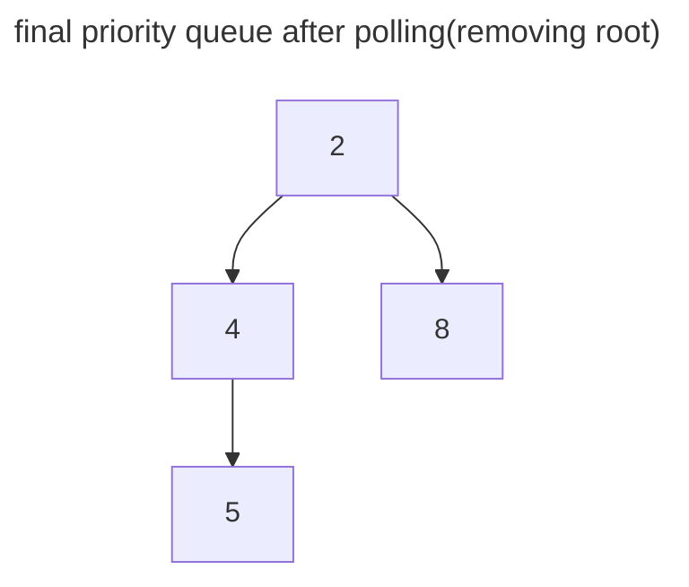

> Similar approach is used for removing any element. we replace it with last node and then we either bubble up/down to finally achieve a valid priority queue.


**Priority Queue Practice Problem**
- [last-stone-weight](https://leetcode.com/problems/last-stone-weight/description/)


# Union Find (Disjoint Set)
- Its a data structures that keep track of elements which are split into two or
more disjoint set.
- It has 2 primary operations `Find` and `Union`

## Uses of Union Find
- Kruskal's Minimum Spanning Tree
- Grid percolation
- Network connectivity
- Least Common ancestor in a tree
- Image Processing


## Complexity analysis of Union Find
|Operation|complexity|
|-|-|
| Construction   | `O(n)` |
| Union    | `⍺(1)` |
| Find  | `⍺(1)` |
| Get Component size | `⍺(n)` |
| Check if Connected | `⍺(n)` |
| Count component | `⍺(1)` |

> `⍺(n)` is amortized constant time

## Implementation
- we can implement `Union Find` using array or linked list (nodes). since working with array is bit 
  simpler we will be showing example with array but same concept can be extended to Linked List implementation
- Create a mapping between actual element and array index (called bijection). This is so that we store this
  mapping instead of actual object in array.

### Union Operation
- point parent node of group with lesser number of  elements to root of group with greater number of elements.

### Find Operation (return group to which element belong)
- Traverse up and return root node

### Example Union Find (Wihout paht compression)
> Note due to limitation with `mermaid.js` array elements have space in between

Lets say we have following element and we create bijections:

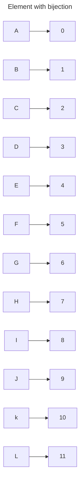

so initially every node is root in its self.

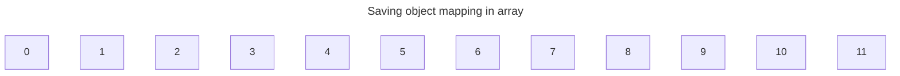

> Union(C, K)

`C` maps to `2` and `K` maps to `10`. So after joining (making `K` root) we would have

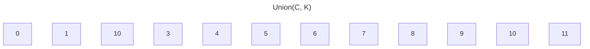

> Union(F, E)

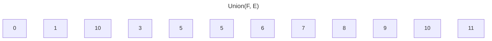

> Union(A, J)


> Union(C, D)

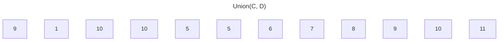

> Union(D, I)

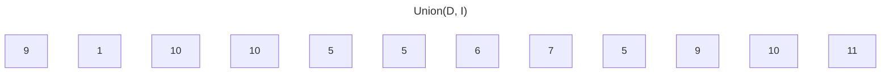

> Union(L, F)

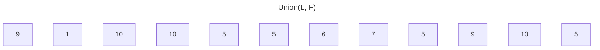

> Union(C, A)

```mermaid
---
title: Union(C, A)
---

graph TD;
  0[9]
  1
  2[10]
  3[10]
  4[5]
  5
  6
  7
  8[5]
  9[10]
  10
  11[5]
```

> Union(A, B)

```mermaid
---
title: Union(A, B)
---

graph TD;
  0[9]
  1[10]
  2[10]
  3[10]
  4[5]
  5
  6
  7
  8[5]
  9[10]
  10
  11[5]
```

> Union(H, G)

```mermaid
---
title: Union(H, G)
---

graph TD;
  0[9]
  1[10]
  2[10]
  3[10]
  4[5]
  5
  6[7]
  7
  8[5]
  9[10]
  10
  11[5]
```

> Union(H, F)

```mermaid
---
title: Union(H, F)
---

graph TD;
  0[9]
  1[10]
  2[10]
  3[10]
  4[5]
  5
  6[7]
  7[5]
  8[5]
  9[10]
  10
  11[5]
```

> Union(H, B)

```mermaid
---
title: Union(H, B)
---

graph TD;
  0[9]
  1[10]
  2[10]
  3[10]
  4[5]
  5[10]
  6[7]
  7[5]
  8[5]
  9[10]
  10
  11[5]
```

We can represent this final structure with nodes as:

```mermaid
graph TD;

A-->K
B-->K
C-->K
D-->K
E-->F
F-->K
G-->H
H-->F
I-->F
J-->K
L-->F
```

> Thing to note here in above graph is that if try to find parent of `G` we would have to make quite a few traversals.
> We can optimized this so essentially almost all of the node points to root node directly thus giving us nice amoritzed
> time complexity for `union` and `find` operations. We perform this optimization during `find` operation and update root
> of element we traversed to point to root.
> Example if we find `G` we would traverse noded `G`, `H`, `F` to find root `K`. so we update root of `G`, `H` and `F`.

```mermaid
---
title: Final structure after applying path compression during find
---

graph TD;

A-->K
B-->K
C-->K
D-->K
E-->F
F-->K
G-->K
H-->K
I-->F
J-->K
L-->F
```


